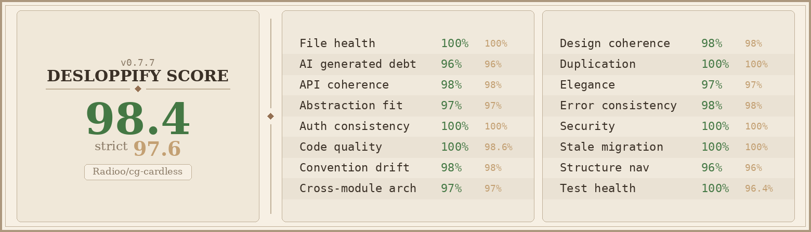

# CG Cardless

A mobile app for cardless access using QR code scanning. Scan venue QR codes, link them with your card ID, and complete entry without a physical card.

Built with [Expo](https://expo.dev) and React Native.

## Get started

1. Install dependencies

   ```bash
   npm install
   ```

2. Start the app

   ```bash
   npm start
   ```

## Project structure

| Directory | Purpose |
|-----------|---------|
| `app/` | Screen routes (Expo Router, default exports) |
| `components/` | Reusable UI components (named exports) |
| `hooks/` | Custom React hooks |
| `utils/` | Card ID conversion and validation logic |
| `constants/` | Theme colors and font definitions |

### Routes

- `/` - Home screen with QR scanner and card status
- `/settings` - Card management (enter, generate, save)
- `/scan-result` - Displays result after scanning a QR code

## Scripts

| Command | Description |
|---------|-------------|
| `npm start` | Start the Expo development server |
| `npm run android` | Start on Android emulator |
| `npm run ios` | Start on iOS simulator |
| `npm run web` | Start in web browser |
| `npm run lint` | Run ESLint |
| `npm test` | Run tests with Jest |
| `npm run test:watch` | Run tests in watch mode |
| `npm run test:ci` | Run tests with coverage (CI) |

